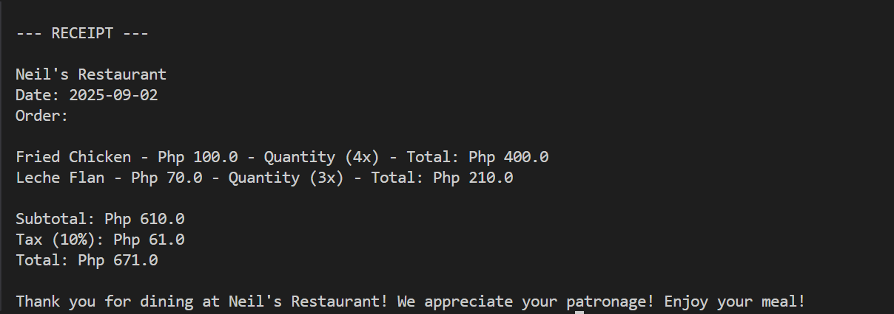

<p align="center">
  
</p>

<h1 align="center">Restaurant Ordering System</h1>

<p align="center">
  <a href="#project-description">Project Description</a> • 
  <a href="#features">Features</a> • 
  <a href="#tech-stack">Tech Stack</a> • 
  <a href="#installation">Installation</a> • 
  <a href="#usage">Usage</a>
</p>

<p align="center">
  
</p>

---

## Project Description

Restaurant Ordering System is a Java console application created as a university lab exercise.
It provides a simple text-based ordering flow: browse menus, add items with quantity, calculate totals (with tax), accept payment, and print a receipt.

---

## Features

- Menu / Desserts / Drinks categories
- Add items with quantity to an order 
- Calculates subtotal, tax (10%), and total
- Payment handling and change calculation
- Receipt generation with date and order summary
- Clear order option and input validation for incorrect entries
---

## Tech Stack

- **Language**: Java  
- **IDE**: IntelliJ IDEA (or any Java IDE)  

---

## Installation

```bash
git clone https://github.com/nca-gabriel/Neil_Restaurant.git
cd Neil_Restaurant
``` 
---
## Usage
Compile & Run via CLI:
cd src
java Main.java
java Main

Run via IntelliJ IDEA:

Open the project in IntelliJ IDEA

Right-click Main.java → Run 'Main.main()'

